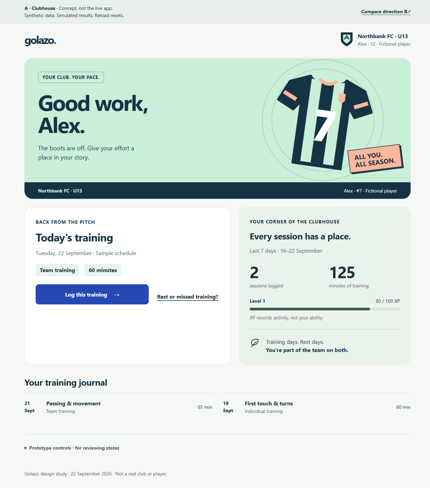
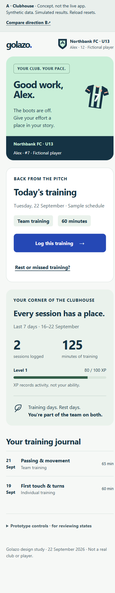
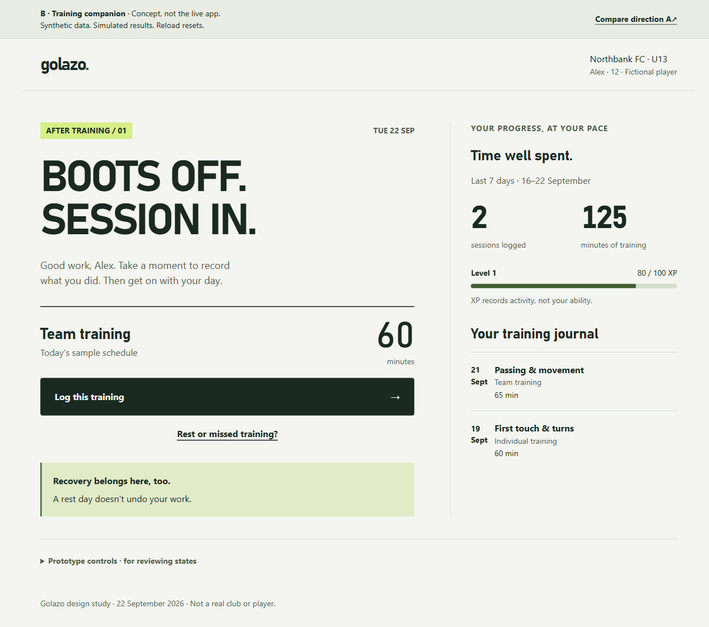
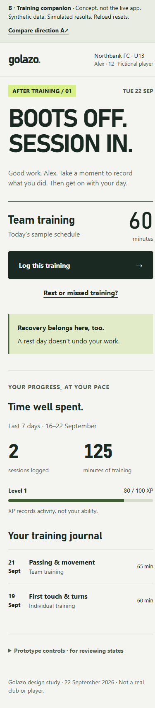

# Golazo · two post-training directions

**Concepts only. Owner choice is pending. Nothing here redesigns the live app.**

The owner confirmed **players aged 10–14, with parents supporting** on
2026-09-22. The first journey is: **finished training → log quickly → understand
progress → leave encouraged**. The canonical brief is
[`.impeccable.md`](../../../.impeccable.md).

## Open the interactive concepts

From this isolated checkout, with an existing Node.js installation:

```powershell
node docs\design-directions\training-20260922\serve.mjs
```

Keep that process attached while reviewing:

- [A — Clubhouse](http://127.0.0.1:4317/clubhouse.html)
- [B — Training companion](http://127.0.0.1:4317/companion.html)

The server binds **127.0.0.1 only**, serves this concept directory, rejects
non-read requests, disables caching and blocks application connections with CSP.
There are no dependencies to install, remote fonts, authentication, APIs,
analytics, localStorage, sessionStorage or sync. Reload resets everything.
Do not enter real player details.

## The choice

| | A · Clubhouse | B · Training companion |
|---|---|---|
| Main idea | This is your place in the club | Record your effort, then leave |
| Composition | Expressive welcome, original jersey, clubhouse board | Linear training journal, one dominant action, quiet progress rail |
| Proposed identity | Navy/mint/coral with a blue action; rounded surfaces | Chalk/ink/lime; athletic type, rules and squared edges |
| Local typography | Segoe UI / system fallback | Bahnschrift with system fallback |
| Reward | An earned “on the board” moment | A concise explanation of what changed |
| Trade-off to assess | More belonging and visual character, more content before the task | Faster visual prioritization, less explicit team personality |

Both share one small synthetic state model and equivalent form controls so the
comparison is not confounded by different functionality. Original inline SVGs
are used only in A; no commercial game assets, mascots or borrowed club crests.
Neither direction is a Rosette skin.

### A — Clubhouse




### B — Training companion




## Same task, same synthetic content

Alex is a fictional 12-year-old at the fictional Northbank FC U13. The fixed demo
date is 22 September 2026. Before today's entry, the last seven days contain two
sessions (65 + 60 = 125 minutes), with 80 total sample XP. A 60-minute entry gives:

- 3 sessions and 185 minutes in the last seven days;
- +20 activity XP, reaching level 2 with 0 / 112 XP toward the next level;
- the player's own optional reflection, not a fabricated skill improvement;
- an explicit finish: no next challenge, streak rescue or pressure to return.

The +20 training award and level thresholds reflect `src/engine/xp.ts` at the
base revision. This is a bounded model, not a replacement progression engine.
Earlier dates earn the sample activity award but do not inflate seven-day
totals. First-use mode starts from zero instead of fabricating a level-up.

Date, all eight training types, duration, 1–5 energy and mood, four optional focus
areas and notes follow `TrainingEntry` / `TrainingLog` concepts. Custom durations
and explicit validation are proposed UX, not changes to production constraints.
The rest/missed-day acknowledgement is a concept-only state, not a new API or
training type.

## Try the states

1. Use **Log this training**. Clear the duration and submit to see validation.
2. Enter a duration; change energy/mood. Open optional details and add a
   made-up note or focus area.
3. Open **Prototype controls** at the bottom and enable **Simulate one save
   failure**. Save: a 700ms wait leads to an explicit error with retained input.
   **Retry demo save** then completes once.
4. Inspect the explained totals, then **Finish for today**. Returning to the
   journal does not offer to log the same session again.
5. Reload and choose **Rest or missed training?**. Neither option changes XP or
   previous training totals, asks for a personal explanation or demands catch-up.
6. Prototype controls also expose first use and long Latvian labels. The latter
   is a layout stress fixture, **not a completed Latvian localization**.

## Verification and limits

Run the dependency-free model tests:

```powershell
node --test docs\design-directions\training-20260922\model.test.mjs
node --check docs\design-directions\training-20260922\concept.js
```

`browser-check.cjs` contains a Playwright callback for an existing browser tool
or harness; it adds no package dependency. Invoke the function with a fresh page
and optional `{ outputDirectory: "<absolute evidence directory>" }` to capture
PNGs. Without that option it performs assertions without writing screenshots.
Each direction runs in a new context, permits only the local origin, and checks
keyboard navigation, validation, recovery, completion, rest/missed days, first
use, long labels, enlargement, contrast, targets and storage. The screenshot
names in this page correspond to the resulting evidence collection.

Observed browser/model results and artifact hashes are in
[verification.json](../../design-evidence/training-20260922/verification.json).
The evidence is **concept verification, not approval or production readiness**.

- Chromium checks include 320/390px mobile, 768px intermediate and 1280px desktop.
- The primary path uses actual Tab/Enter/Space through visible controls. Failures
  retain notes, focus selections, duration and mood; retry gives the expected
  totals. Reload resets the concept. No private data or live services were used.
- Text enlargement uses root font-size **200% (16→32px)**, not browser zoom,
  device-scale emulation or a claim about pinch zoom. Actual native browser zoom,
  other engines, screen-reader operation and real touch hardware are not verified.
- Contrast measurement covers rendered HTML text and actual ancestor
  backgrounds, including selected+hover, primary hover, waiting, failure and
  completion. Original SVGs are decorative/hidden from assistive technology.
  The scan is not a WCAG conformance certificate.
- Reduced motion removes the completion entrance; normal mode uses one 320ms
  transform/opacity entrance. It carries no essential information.
- Initial resources are local HTML, two CSS files and two JS modules. There are
  no lazy production chunks or real API failure states to test. Observed transfer
  sizes are local lab evidence, not field Core Web Vitals or an approved budget.

### Preflight limitations

The supplied current governance checkout at
`25719b1fba2eec0f60188840c9f7adbcdd1490c2` was read explicitly.
Its `design-session.py preflight` reported that the skill loader's copy was
stale (exit 1). The current charter/skills and the confirmed brief were used;
no skills were edited or cleaned up. A new governance fetch/API ref check was
denied with HTTP 404, so this agent does not claim fresh remote governance
verification beyond the parent's supplied checkout.

The untouched product baseline `npm test -- --run tests/xp.test.ts` could not
start because this worktree has no installed Vitest. No dependency restore or
download was needed for the standalone concept, and production build/test
success is **not claimed**.

## Delivery boundary

Only the canonical brief, its AGENTS link, these isolated concepts and their
evidence change. Production source/backend/theme/logic/dependencies/CI are
untouched. Independent review is pending with the parent coordinator; no
representative-player or parent usability test has taken place.

**Stop for the owner's choice: A, B, or revisions to both.**
No push, PR, merge or deployment is authorized by this concept task.
